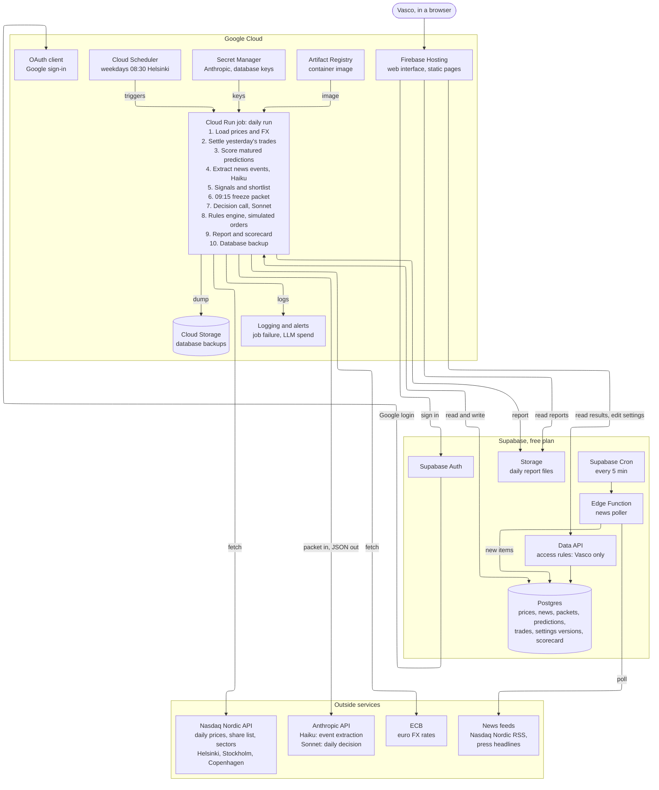

# Architecture

Where each part runs. Rendered image: `docs/architecture.png`.

```mermaid
---
config:
  layout: elk
---
flowchart TB
    vasco([Vasco, in a browser])

    subgraph google[Google Cloud]
        direction TB
        scheduler[Cloud Scheduler<br/>weekdays 08:30 Helsinki]
        registry[Artifact Registry<br/>container image]
        secrets[Secret Manager<br/>Anthropic, database keys]
        job["Cloud Run job: daily run<br/>1. Load prices and FX<br/>2. Settle yesterday's trades<br/>3. Score matured predictions<br/>4. Extract news events, Haiku<br/>5. Signals and shortlist<br/>6. 09:15 freeze packet<br/>7. Decision call, Sonnet<br/>8. Rules engine, simulated orders<br/>9. Report and scorecard<br/>10. Database backup"]
        alerts[Logging and alerts<br/>job failure, LLM spend]
        backup[(Cloud Storage<br/>database backups)]
        hosting[Firebase Hosting<br/>web interface, static pages]
        oauth[OAuth client<br/>Google sign-in]
    end

    subgraph supabase[Supabase, free plan]
        direction TB
        cron[Supabase Cron<br/>every 5 min]
        poller[Edge Function<br/>news poller]
        db[(Postgres<br/>prices, news, packets, predictions,<br/>trades, settings versions, scorecard)]
        api[Data API<br/>access rules: Vasco only]
        auth[Supabase Auth]
        storage[Storage<br/>daily report files]
    end

    subgraph external[Outside services]
        nasdaq[Nasdaq Nordic API<br/>daily prices, share list, sectors<br/>Helsinki, Stockholm, Copenhagen]
        ecb[ECB<br/>euro FX rates]
        anthropic[Anthropic API<br/>Haiku: event extraction<br/>Sonnet: daily decision]
        news[News feeds<br/>Nasdaq Nordic RSS,<br/>press headlines]
    end

    %% Scheduling and deployment
    scheduler -->|triggers| job
    registry -->|image| job
    secrets -->|keys| job
    job -->|logs| alerts

    %% Daily run
    job -->|fetch| nasdaq
    job -->|fetch| ecb
    job -->|packet in, JSON out| anthropic
    job <-->|read and write| db
    job -->|report| storage
    job -->|dump| backup

    %% News collection
    cron --> poller
    poller -->|poll| news
    poller -->|new items| db

    %% Web interface
    vasco --> hosting
    hosting -->|sign in| auth
    auth -->|Google login| oauth
    hosting -->|read results, edit settings| api
    api --> db
    hosting -->|read reports| storage
```
